# Diagrame arhitectură ProFolio

Acest document conține:
1. **Diagramă de arhitectură** la nivel înalt (componente)
2. **Diagramă C4 — Context + Container**
3. **Diagramă UML — Class diagram** (modele DB + relații)
4. **Diagramă ER** (Entity-Relationship)
5. **Workflow — Upload + parsare CV**
6. **Workflow — Scanare joburi**
7. **Workflow — Optimizare CV + Cover Letter**
8. **Workflow — Authentication & JWT**
9. **Sequence diagram — Generare materiale aplicare**
10. **State diagram — Status UserJob**
11. **Deployment diagram**

Diagramele sunt în format **Mermaid** și se randează automat în GitHub, VS Code (cu extensia Markdown Preview Mermaid Support), și pe majoritatea platformelor de Markdown.

---

## 1. Arhitectura componentelor (high-level)

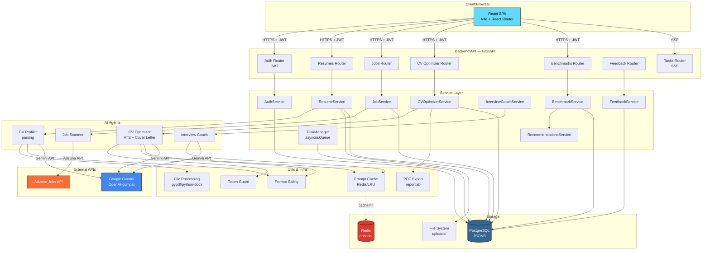

---

## 2. C4 — Context & Containers

### Context (System Context Diagram)

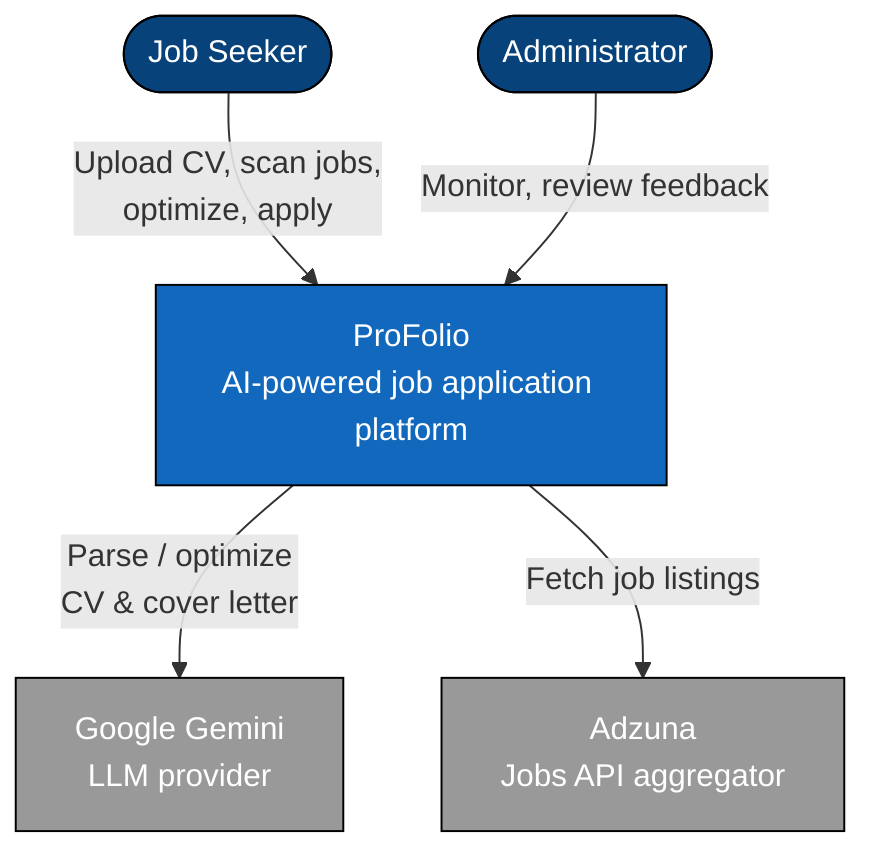

### Container diagram

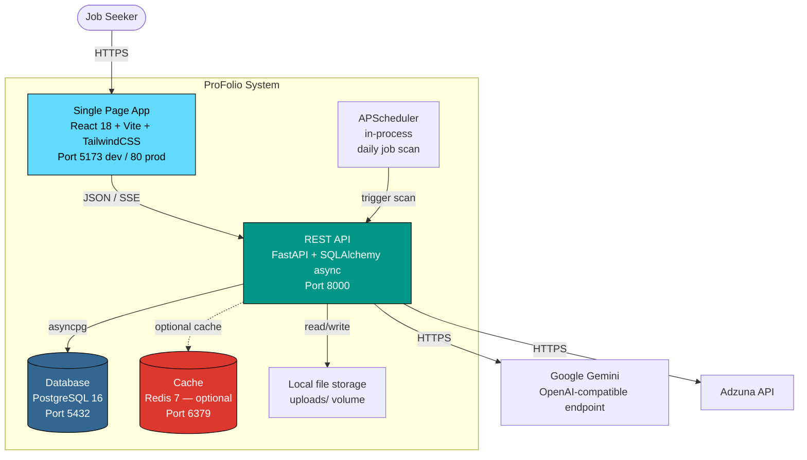

---

## 3. UML Class Diagram — Modele DB

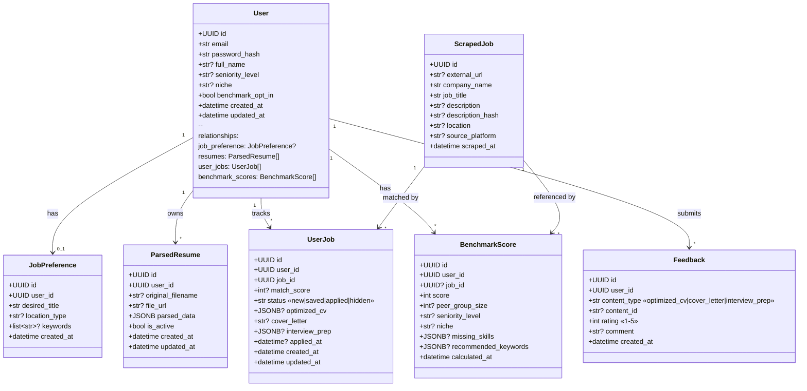

---

## 4. Entity-Relationship Diagram

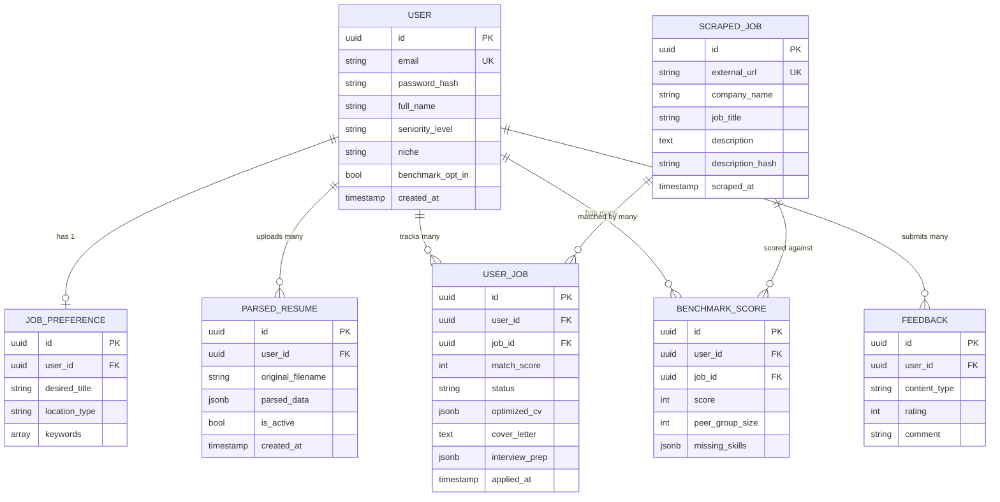

---

## 5. Workflow — Upload + Parsare CV

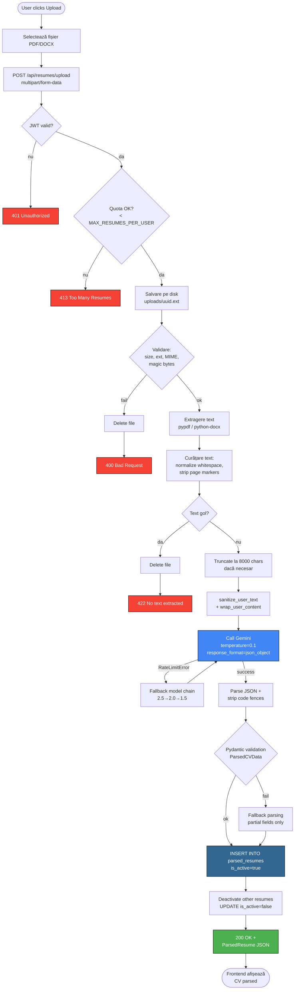

---

## 6. Workflow — Scanare joburi

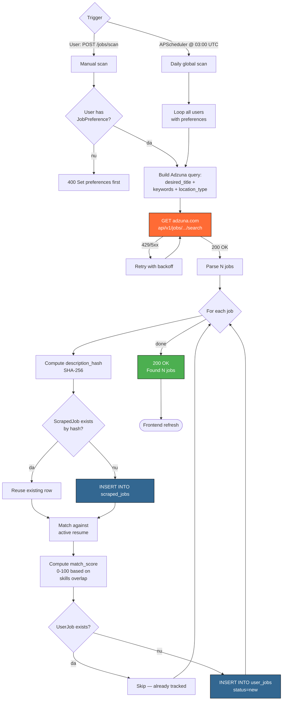

---

## 7. Workflow — Optimizare CV + Cover Letter

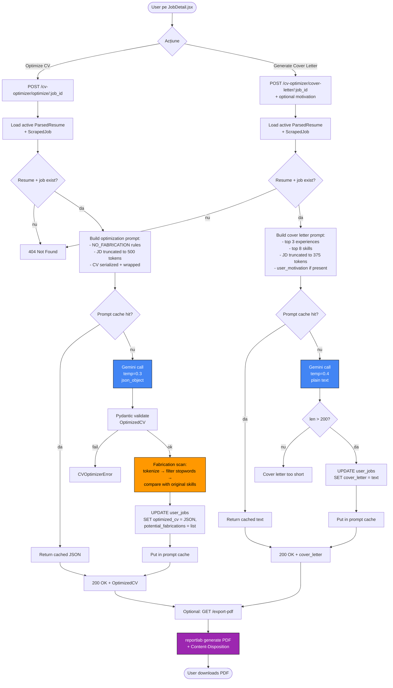

---

## 8. Workflow — Authentication (JWT)

```mermaid
flowchart LR
    subgraph "Register"
        R1[POST /api/auth/register<br/>email + password + name] --> R2{Email unique?}
        R2 -->|nu| R3[409 Email exists]
        R2 -->|da| R4[Hash password<br/>bcrypt cost=12]
        R4 --> R5[INSERT INTO users]
        R5 --> R6[201 Created + UserOut]
    end

    subgraph "Login"
        L1[POST /api/auth/login<br/>email + password] --> L2{Rate limit OK?<br/>5/min}
        L2 -->|nu| L3[429 Too Many]
        L2 -->|da| L4[SELECT user by email]
        L4 --> L5{User exists?}
        L5 -->|nu| L6[401 Invalid creds]
        L5 -->|da| L7{bcrypt.verify<br/>password}
        L7 -->|nu| L6
        L7 -->|da| L8[Sign JWT<br/>HS256<br/>exp 24h]
        L8 --> L9[200 OK +<br/>access_token]
    end

    subgraph "Protected request"
        P1[GET /api/me<br/>Bearer token] --> P2{Header present?}
        P2 -->|nu| P3[401]
        P2 -->|da| P4{JWT signature valid?}
        P4 -->|nu| P3
        P4 -->|da| P5{exp > now?}
        P5 -->|nu| P3
        P5 -->|da| P6[SELECT user by sub]
        P6 --> P7{User exists +<br/>not deleted?}
        P7 -->|nu| P3
        P7 -->|da| P8[Inject user în endpoint]
        P8 --> P9[200 OK + data]
    end

    R6 -.->|client stores token<br/>localStorage| L1
    L9 -.->|Authorization header| P1
```

---

## 9. Sequence Diagram — Generare materiale aplicare complete

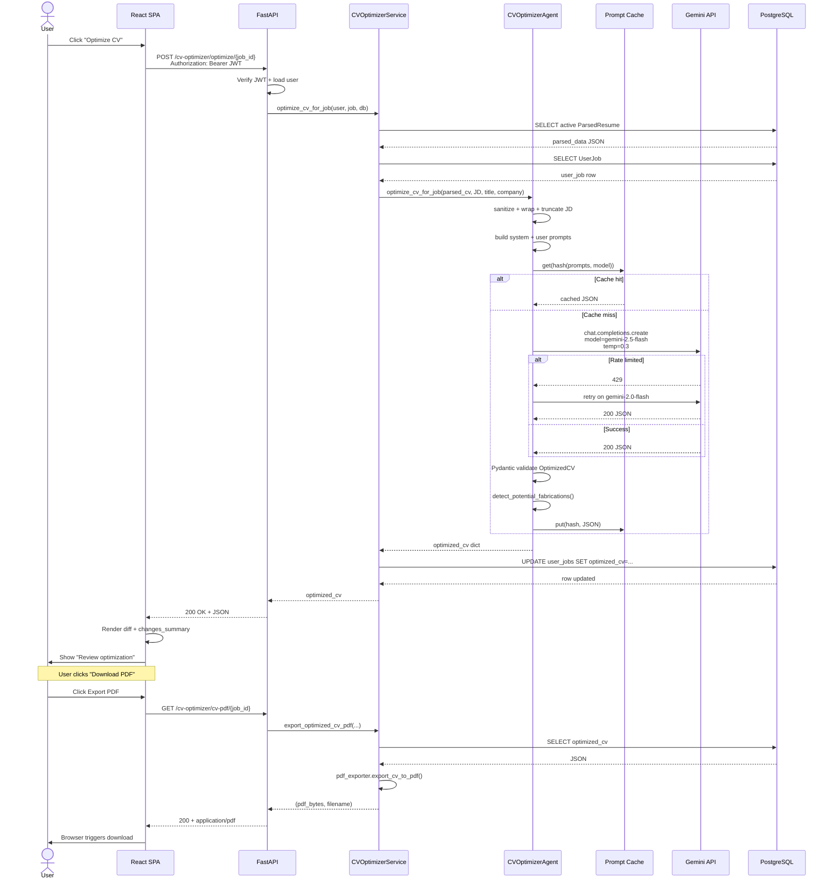

---

## 10. State Diagram — UserJob status

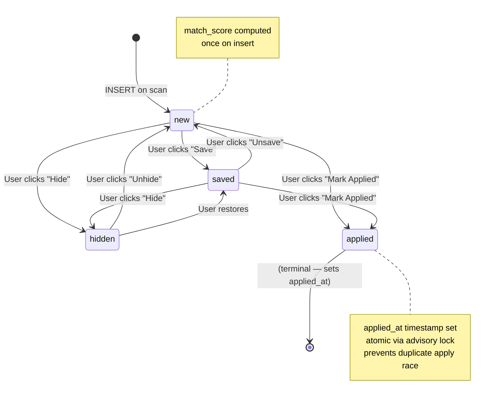

---

## 11. Deployment Diagram

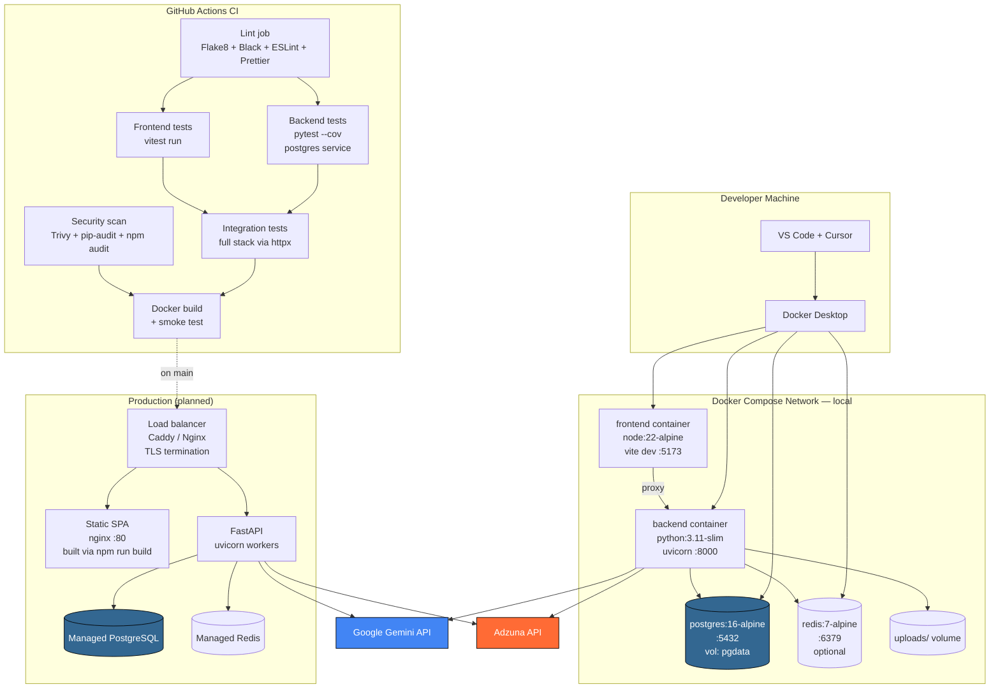

---

## 12. UML — Class Diagram pentru AI Agents

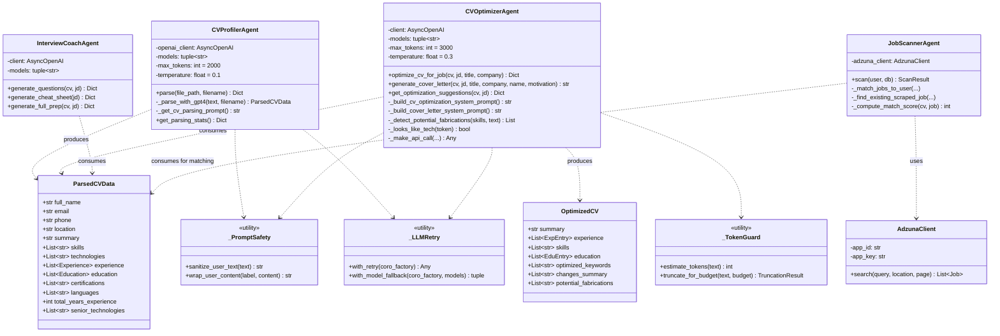

---

## 13. Use-case diagram

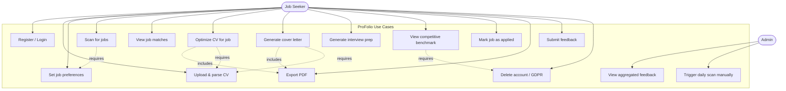

---

## 14. Cum vizualizezi diagramele

### În VS Code / Cursor
1. Instalează extensia **"Markdown Preview Mermaid Support"** (id: `bierner.markdown-mermaid`)
2. Deschide acest fișier și apasă `Cmd+Shift+V` (preview)

### Pe GitHub
Diagramele Mermaid se randează **automat** când vizualizezi fișierul `.md` pe github.com.

### Export ca PNG/SVG
```bash
npx -p @mermaid-js/mermaid-cli mmdc -i docs/architecture-diagrams.md -o diagram.png
```

### Live editor (debug)
[https://mermaid.live](https://mermaid.live) — paste any block între ` ```mermaid ` și verifică.
